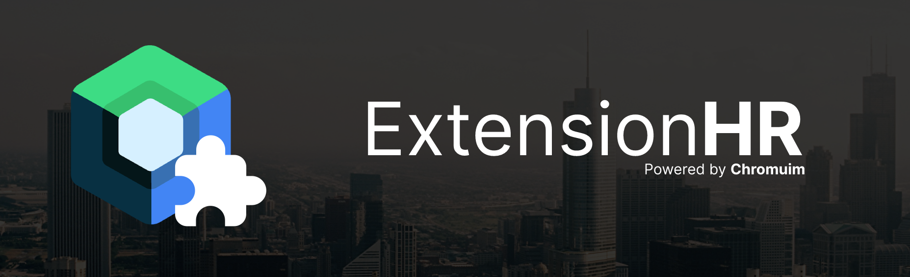
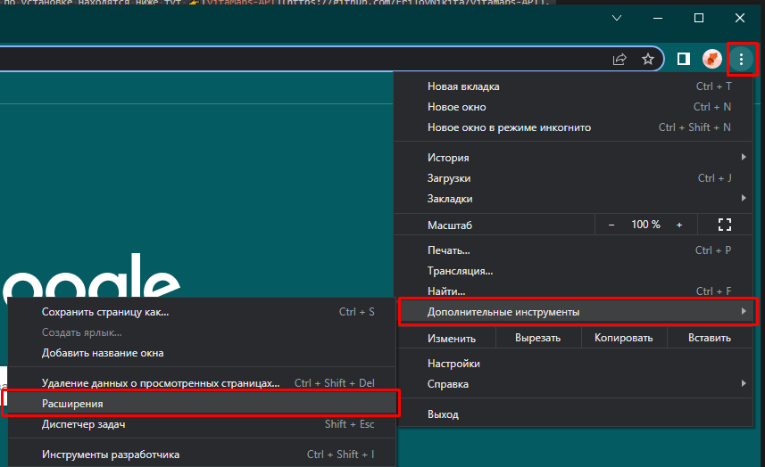
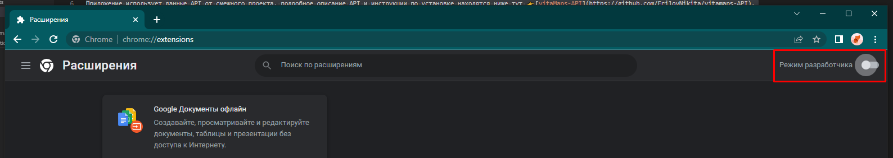
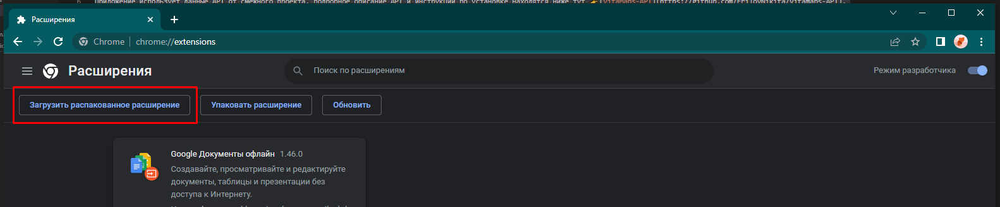
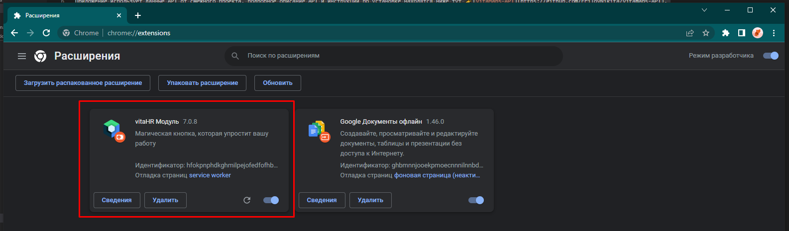
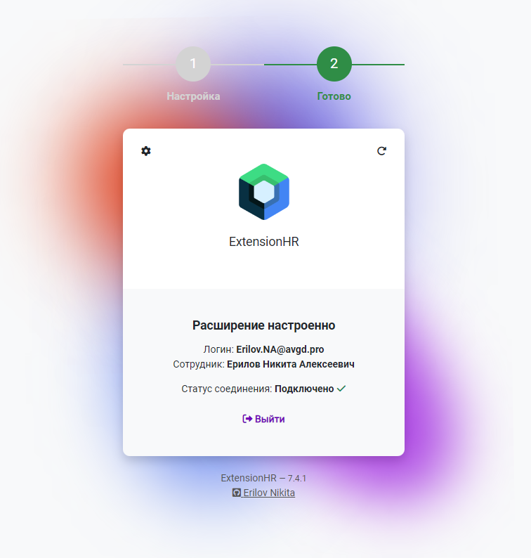

# vitaHR - Chromium Extension

Расширение для браузеров на базе движка Chromium. 
Данный проект - полноценный модуль для работы с интеграциями рекрутинговых ресурсов с Naumen Service Desk.

## Поддерживаемые ресурсы
- [x] HeadHunter
- [x] Avito
- [x] SuperJob
- [x] Хабр Карьера

## Установка приложения
Приложение представлено в видео готового пакета для установки в браузер, ниже представлена инструкция по установке

В меню вашего браузера, выберите пункт **Дополнительнеы параметры**, затем в выподающем списке пункт **Расширения**

В правом верхнем углу, включите Режим разработчика

Теперь у вас появится возможность загружать распакованное расширения

🎉Готово! Теперь ваше расширение успешно установлено

## Скриншоты

